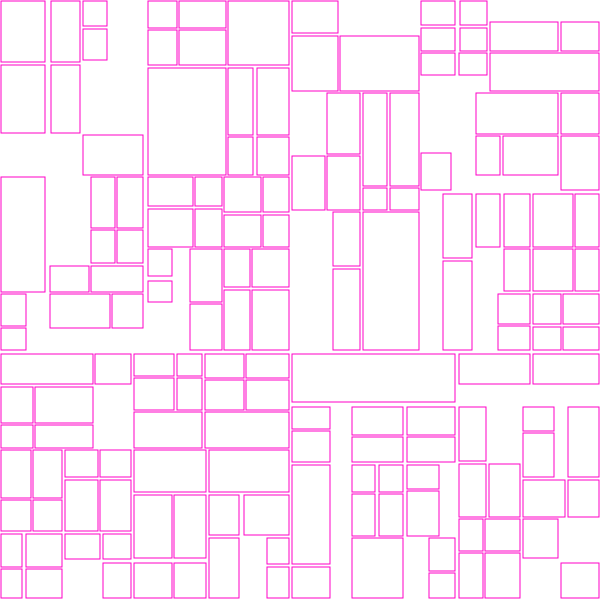
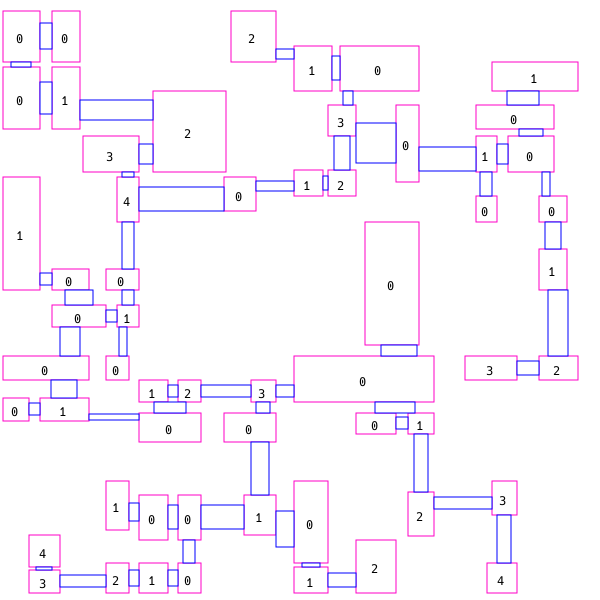

# QuadDungeon Generator

This a quad dungeon generator useful for generating 2D dungeons or cities with parameters for specifying different roomTypes and different passageTypes.
Many compile time rules are implemented for generating different printStatements (usefule for creating svgs or positional data)

It works splitting a 2D space using horizontal and vertical lines in bin zones and generates a random quad tree adjusting its children zone node size accordingly to its maximum size delimited by its own bin (just how roads align buildings in a city). Behaviour can be modified supplying different parameters to the generator, some examples:

]
